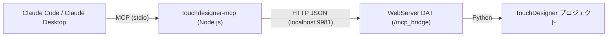

# touchdesigner-mcp

TouchDesigner を Claude (Claude Code / Claude Desktop) から操作するための MCP サーバーです。
ネットワークの構築・パラメータ調整に加えて、**TOP のレンダリング画像や画面のスクリーンショットを Claude が「見ながら」**作業できるのが特徴です。



## 必要なもの

- TouchDesigner (2022 以降推奨)
- Node.js 18 以上

## セットアップ

### かんたんインストール (推奨)

**macOS / Linux:**

```bash
curl -fsSL https://raw.githubusercontent.com/mintiasaikoh/touchdesigner-mcp/main/install.sh | bash
```

**Windows (PowerShell):**

```powershell
irm https://raw.githubusercontent.com/mintiasaikoh/touchdesigner-mcp/main/install.ps1 | iex
```

`~/touchdesigner-mcp` にクローン → ビルド → Claude Code への登録まで自動でやります(claude CLI が無い場合は手動登録の手順を表示)。実行後は「[2. TouchDesigner 側にブリッジをインストール](#2-touchdesigner-側にブリッジをインストール)」だけやれば完了です。

### 1. MCP サーバーをビルド (手動でやる場合)

```bash
git clone https://github.com/mintiasaikoh/touchdesigner-mcp.git
cd touchdesigner-mcp
npm install
npm run build
```

### 2. TouchDesigner 側にブリッジをインストール

#### 方法A: mcp_bridge.tox をドラッグ&ドロップ (推奨)

[`td/mcp_bridge.tox`](td/mcp_bridge.tox) をネットワークにドラッグ&ドロップするだけです。
配置した瞬間から WebServer DAT が `http://127.0.0.1:9981` で待ち受けます。
**プロジェクトを保存すればブリッジも一緒に保存される**ので、次回以降は .toe を開くだけで接続できます。

インストールスクリプト(かんたんインストール)を使った場合は、tox が TouchDesigner の
ユーザーパレットにも自動コピーされるので、パレットの **My Components** からドラッグできます。
手動でパレットに入れる場合のコピー先:

- macOS: `~/Library/Application Support/Derivative/TouchDesigner099/Palette/`
- Windows: `%LOCALAPPDATA%\Derivative\TouchDesigner099\Palette\`

#### 方法B: setup_mcp.py を実行

1. ネットワークに **Text DAT** を 1 個作る
2. [`td/setup_mcp.py`](td/setup_mcp.py) の中身を全部コピーして Text DAT にペースト
3. Text DAT を右クリック → **Run Script**

`/mcp_bridge` という Base COMP が作られます。Textport (Alt+T) に直接ペーストして実行しても OK。
再実行はいつでも安全で、ハンドラが最新版に上書きされます。
(`mcp_bridge.tox` はこのスクリプトの実行結果を書き出したものです。ハンドラを変更したら
`op('/mcp_bridge').save('td/mcp_bridge.tox')` で tox も再生成してください)

> ⚠️ ブリッジは任意の Python を実行できるので、信頼できないネットワークに公開しないでください。ローカルマシンでの利用を想定しています。

### 3. Claude に登録

**Claude Code:**

```bash
claude mcp add touchdesigner -- node /absolute/path/to/touchdesigner-mcp/dist/index.js
```

**Claude Desktop** (`claude_desktop_config.json`):

```json
{
  "mcpServers": {
    "touchdesigner": {
      "command": "node",
      "args": ["/absolute/path/to/touchdesigner-mcp/dist/index.js"]
    }
  }
}
```

ポートを変えた場合は `setup_mcp.py` の `PORT` を変更したうえで、環境変数を渡します:

```json
      "env": { "TD_WEBSERVER_URL": "http://127.0.0.1:9999" }
```

## ツール一覧

| ツール | 説明 |
| --- | --- |
| `td_info` | TD のバージョン・プロジェクト情報・FPS を取得(接続確認にも) |
| `td_list_operators` | ネットワーク内のオペレーター一覧(family / 名前パターンで絞り込み可) |
| `td_get_operator` | 1 オペレーターの詳細(パラメータ・接続・エラー) |
| `td_create_operator` | オペレーター作成(`noiseTOP` などのクラス名指定、初期パラメータ設定可) |
| `td_set_parameters` | パラメータ設定(値・配列・`{"expr": ...}` で式も可) |
| `td_connect_operators` | オペレーター同士の配線 |
| `td_delete_operator` | オペレーター削除 |
| `td_capture_top` | **任意の TOP の絵を PNG で取得** — Claude がレンダリング結果を見て判断できる |
| `td_screenshot` | **画面全体のスクリーンショット** — ネットワークエディタや UI そのものを見られる |
| `td_get_errors` | ネットワーク全体のエラー / 警告を一覧 |
| `td_execute_python` | TD 内で任意の Python を実行(タイムライン操作・保存など何でも) |

## 使い方の例

Claude にこんなふうに頼めます:

- 「`td_info` で TouchDesigner につながってるか確認して」
- 「/project1 に ノイズ → ブラー → Out のネットワークを作って、絵を見せて」
- 「out1 の絵をキャプチャして、もっとサイケな色になるようにパラメータを詰めて」
- 「スクリーンショットを撮って、いま画面に出てるエラーを直して」
- 「エラーが出てるノードを全部リストアップして原因を調べて」

`td_capture_top` → パラメータ調整 → 再キャプチャ、というループで Claude が絵を確認しながら追い込んでいけます。

## トラブルシューティング

- **「Cannot reach TouchDesigner」** — TD が起動しているか、`setup_mcp.py` を実行済みか確認。`/mcp_bridge/mcp_webserver` の Active が On になっているかも確認してください。ブラウザで `http://127.0.0.1:9981` を開くと動作確認できます。
- **ポートが使われている** — `setup_mcp.py` の `PORT` を変更して再実行し、MCP 側に `TD_WEBSERVER_URL` を設定。
- **macOS で `td_screenshot` が真っ黒 / 失敗する** — システム設定 → プライバシーとセキュリティ → 画面収録 で、MCP サーバーを起動しているアプリ(ターミナル / Claude Desktop)に許可を与えてください。
- **Linux で `td_screenshot` を使う** — ImageMagick (`import` コマンド) が必要です。

## ライセンス

MIT
